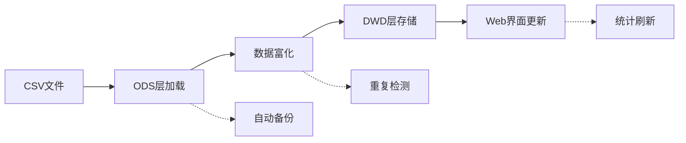

# 📋 轻量级数据平台 - 部署和使用指南

## 📊 数据存储位置

### 当前存储
```bash
# 数据库文件位置
D:\project\nginx-log-analyzer\light-data-platform\database\nginx_analytics.db

# 当前大小：421KB (98条样本数据)
# 预估容量：10万条记录约400MB
```

### 表结构
- **ods_nginx_log**: 原始CSV数据存储
- **dwd_nginx_enriched**: 富化后的维度标签数据  
- **dws_platform_hourly**: 按维度聚合数据 [预留]
- **ads_anomaly_log**: 异常检测结果 [预留]

## 🔄 日常数据导入

### 方式一：手动导入单个CSV
```bash
cd light-data-platform

# 导入指定CSV文件（自动备份）
python scripts/daily_import.py --csv-path "/path/to/new_data.csv"

# 导入时不备份数据库
python scripts/daily_import.py --csv-path "/path/to/new_data.csv" --no-backup
```

### 方式二：监控目录自动导入
```bash
# 监控指定目录，自动处理新的CSV文件
python scripts/daily_import.py --watch-dir "/path/to/csv_directory"

# 处理后的文件会自动移动到 processed/ 子目录
```

### 方式三：使用默认配置
```bash
# 使用 config/settings.py 中配置的默认CSV路径
python scripts/daily_import.py

# 当前默认路径：
# DATA_SOURCE['default_csv_path'] = "data/demo/自研Ng2025.05.09日志-样例_分析结果_20250829_224524_temp/processed_logs.csv"
```

### 数据导入流程


## 📈 数据管理命令

### 查看数据库状态
```bash
# 显示详细统计信息
python scripts/daily_import.py --stats

# 输出示例：
# 数据库大小: 0.41 MB
# ODS记录数: 98
# DWD记录数: 98  
# 数据质量评分: 1.0
# 数据时间范围: 2025-05-09 11:16:11 ~ 2025-05-09 11:16:37
```

### 备份管理
```bash
# 手动备份数据库
python scripts/daily_import.py --backup

# 清理7天前的备份文件
python scripts/daily_import.py --cleanup 7

# 备份文件位置：backups/nginx_analytics_backup_YYYYMMDD_HHMMSS.db
```

### 直接使用数据处理器
```bash
# ODS层操作
python data_pipeline/ods_processor.py --csv-path "/path/to/file.csv"
python data_pipeline/ods_processor.py --stats

# DWD层操作  
python data_pipeline/dwd_processor.py --process
python data_pipeline/dwd_processor.py --analyze
```

## 🚀 ClickHouse升级方案

### 准备工作
```bash
# 安装ClickHouse客户端
pip install clickhouse-connect

# 确保ClickHouse服务运行
# Docker方式：
docker run -d --name clickhouse-server --ulimit nofile=262144:262144 -p 8123:8123 clickhouse/clickhouse-server

# 或下载安装包：https://clickhouse.com/docs/en/install
```

### 升级步骤

#### 1. 初始化ClickHouse环境
```bash
cd light-data-platform

# 初始化数据库和表结构
python migration/clickhouse_migration.py --init --host localhost --port 8123

# 创建的表：
# - nginx_analytics.ods_nginx_log (原始数据)
# - nginx_analytics.dwd_nginx_enriched (富化数据)  
# - nginx_analytics.dws_platform_hourly (聚合数据)
```

#### 2. 迁移SQLite数据
```bash
# 执行完整数据迁移
python migration/clickhouse_migration.py --migrate --host localhost --port 8123

# 分别迁移ODS和DWD数据，支持10万条/批次高速迁移
```

#### 3. 验证迁移结果
```bash
# 数据一致性验证
python migration/clickhouse_migration.py --verify --host localhost --port 8123

# 输出示例：
# ClickHouse ODS记录数: 98
# ClickHouse DWD记录数: 98  
# SQLite ODS记录数: 98
# SQLite DWD记录数: 98
# 数据一致性检查: ODS: ✓ DWD: ✓
```

#### 4. 性能对比测试
```bash
python migration/clickhouse_migration.py --performance --host localhost --port 8123

# 预期性能提升：
# - 查询速度：10-100x提升
# - 存储压缩：50-80%空间节省
# - 并发能力：支持百万级记录
```

### ClickHouse优势
| 对比项 | SQLite | ClickHouse |
|--------|--------|------------|
| **数据量支持** | <10万条 | 千万级+ |
| **查询性能** | 秒级 | 毫秒级 |
| **并发查询** | 单线程 | 高并发 |
| **数据压缩** | 无 | 10:1压缩比 |
| **实时聚合** | 需计算 | 物化视图 |
| **扩展性** | 单机 | 分布式集群 |

### 升级后的配置修改
```python
# config/clickhouse_settings.py
CLICKHOUSE = {
    'host': 'localhost',
    'port': 8123,
    'username': 'default', 
    'password': '',
    'database': 'nginx_analytics'
}

# Web应用自动切换到ClickHouse查询
```

## 📊 监控和维护

### 数据质量监控
```bash
# 每日数据质量报告
python scripts/daily_import.py --stats

# 关键指标：
# - 数据质量评分 (目标: >0.9)
# - 成功率 (目标: >95%)  
# - 慢请求率 (目标: <5%)
# - 异常率 (目标: <1%)
```

### 性能监控
```bash
# SQLite性能基线（当前）
# - 98条记录：统计查询 0.026秒
# - 预期10万条：查询 3秒
# - 预期100万条：查询 30秒+ [需升级ClickHouse]

# ClickHouse性能目标
# - 100万条记录：查询 <100毫秒
# - 1000万条记录：查询 <500毫秒  
```

### 维护任务
```bash
# 每日任务
python scripts/daily_import.py --watch-dir "/data/nginx_logs"

# 每周任务  
python scripts/daily_import.py --cleanup 7  # 清理旧备份

# 每月任务
# 评估数据量增长，决定是否升级ClickHouse
# 当数据库大小 >100MB 或查询时间 >5秒 时建议升级
```

## 🔧 故障排除

### 常见问题

#### 1. CSV字段不匹配
```bash
# 错误：KeyError: 'timestamp' 
# 解决：检查CSV字段名，修改 field_mapping

# 当前支持的字段映射：
# timestamp <- raw_time, arrival_time
# client_ip <- client_ip_address  
# user_agent <- user_agent_string
# referer <- referer_url
```

#### 2. 内存不足
```bash
# 错误：MemoryError
# 解决：减少批处理大小

python scripts/daily_import.py --csv-path "/path/to/large.csv"
# 修改 batch_size 参数 (默认1000 -> 500)
```

#### 3. 数据库锁定
```bash
# 错误：database is locked
# 解决：停止Web服务后重试

# 停止Web服务
ps aux | grep "web_app/app.py" | awk '{print $2}' | xargs kill

# 重新导入数据
python scripts/daily_import.py --csv-path "/path/to/file.csv"

# 重启Web服务
python web_app/app.py
```

#### 4. ClickHouse连接失败  
```bash
# 错误：Connection refused
# 解决：检查ClickHouse服务状态

# Docker方式重启
docker restart clickhouse-server

# 检查端口
telnet localhost 8123
```

## 🎯 最佳实践

### 数据导入策略
1. **增量导入**: 每日只导入新数据，避免重复
2. **自动备份**: 导入前自动备份，失败时可回滚  
3. **批处理**: 大文件分批处理，避免内存溢出
4. **监控目录**: 使用watch-dir实现自动化

### 性能优化
1. **SQLite阶段**: 数据量<10万条，查询<5秒
2. **升级时机**: 数据库>100MB或查询>5秒时升级ClickHouse  
3. **索引优化**: ClickHouse按时间+平台+API分类建索引
4. **物化视图**: 实时聚合常用查询，提升响应速度

### 运维建议
1. **定时备份**: 每日自动备份，保留7天
2. **性能监控**: 定期检查查询响应时间
3. **容量规划**: 预估数据增长，提前升级
4. **日志审计**: 记录所有导入操作和错误

通过这套完整的部署和运维方案，您可以从轻量级SQLite平台平滑升级到企业级ClickHouse平台，实现nginx日志分析的全面提升！🚀