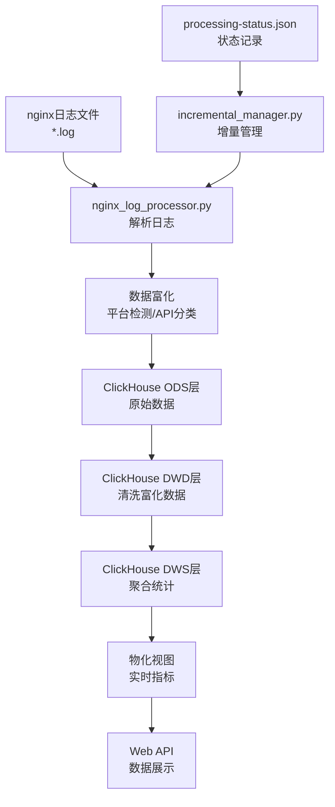

# ClickHouse Nginx日志分析系统使用指南

## 📁 目录结构说明

```
light-data-platform/                    # 主项目目录
├── sample_nginx_logs/                  # 📂 nginx日志存放目录
│   ├── 2025-08-29/                     # 按日期分目录
│   │   ├── nginx1.log                  # nginx服务器1的日志
│   │   ├── nginx2.log                  # nginx服务器2的日志
│   │   └── api-gateway.log             # API网关日志
│   ├── 2025-08-30/
│   │   └── ...
│   └── 2025-08-31/
│       └── ...
├── processing-status.json              # 🔄 处理状态记录文件
├── process_nginx_logs.py               # 🚀 主处理入口脚本
├── clear_all_data.py                   # 🗑️ 一键清理数据脚本
├── setup_clickhouse_pipeline.py        # ⚙️ 系统初始化脚本
├── scripts/                            # 📜 核心脚本目录
│   ├── nginx_log_processor.py          # nginx日志解析器
│   ├── incremental_manager.py          # 增量处理管理器
│   └── clickhouse_pipeline.py          # ClickHouse数据管道
├── web_app/                            # 🌐 Web界面
│   ├── clickhouse_app.py               # ClickHouse版Web应用
│   └── templates/                      # HTML模板
├── docker/                             # 🐳 Docker配置
│   ├── docker-compose-simple.yml       # 简化版Docker配置
│   └── clickhouse_init/                # ClickHouse初始化SQL
└── data_pipeline/                      # 🔧 数据处理组件
    └── clickhouse_processor.py         # ClickHouse处理器
```

## 🔄 数据流转流程



### 详细数据流转说明:

1. **日志收集**: nginx日志文件按日期放入 `sample_nginx_logs/YYYY-MM-DD/` 目录
2. **状态检查**: 系统检查 `processing-status.json` 确定哪些文件需要处理
3. **日志解析**: `nginx_log_processor.py` 解析标准nginx格式日志
4. **数据富化**: 自动检测平台(iOS/Android/Windows)、分类API(业务/认证/静态资源)
5. **分层存储**: 
   - ODS层: 原始日志数据
   - DWD层: 清洗富化后的数据
   - DWS层: 按小时/天聚合的统计数据
   - ADS层: 应用分析数据
6. **实时计算**: 物化视图自动更新性能指标
7. **Web展示**: 通过Web界面查看分析结果

## 🚀 具体使用方法

### **第一步: 准备nginx日志**

1. **创建目录结构**:
```bash
mkdir -p sample_nginx_logs/2025-08-30
```

2. **放置日志文件**:
```bash
# 将nginx日志文件复制到对应日期目录
cp /var/log/nginx/access.log sample_nginx_logs/2025-08-30/nginx1.log
cp /var/log/nginx/api-gateway.log sample_nginx_logs/2025-08-30/api-gateway.log
```

3. **nginx日志格式要求** (标准Combined Log格式):
```
192.168.1.100 - - [30/Aug/2025:10:15:30 +0800] "GET /api/v1/users HTTP/1.1" 200 1234 "https://example.com" "Mozilla/5.0..." 0.156 0.142
```

### **第二步: 处理nginx日志**

#### **首次处理 (全量模式)**:
```bash
cd light-data-platform
python process_nginx_logs.py --log-dir sample_nginx_logs --date 2025-08-30 --mode full
```

#### **日常处理 (增量模式)**:
```bash
# 自动检测新文件
python process_nginx_logs.py --log-dir sample_nginx_logs

# 处理指定日期
python process_nginx_logs.py --log-dir sample_nginx_logs --date 2025-08-30
```

#### **批量处理多天**:
```bash
# 不指定日期，处理所有未处理的日志
python process_nginx_logs.py --log-dir sample_nginx_logs --mode incremental
```

### **第三步: 查看处理状态**

```bash
# 查看总体状态
python process_nginx_logs.py --status

# 查看指定日期状态
python process_nginx_logs.py --status --date 2025-08-30

# 重置失败文件 (可重新处理)
python process_nginx_logs.py --reset-failed
```

### **第四步: 启动Web界面**

```bash
# 启动Web服务
python web_app/clickhouse_app.py

# 访问Web界面
# http://localhost:5001
```

## 🗑️ 测试时清空数据

### **一键清空所有数据**:
```bash
python clear_all_data.py
```
这会清空:
- ClickHouse中的所有nginx日志数据
- 处理状态记录文件
- 示例日志文件

### **手动清空部分数据**:

#### 只清空ClickHouse数据:
```bash
docker exec nginx-analytics-clickhouse-simple clickhouse-client \
  --user web_user --password web_password --database nginx_analytics \
  --query "TRUNCATE TABLE ods_nginx_log; TRUNCATE TABLE dwd_nginx_enriched;"
```

#### 只清空状态文件:
```bash
rm processing-status.json
```

#### 只清空示例日志:
```bash
rm -rf sample_nginx_logs/*/
```

## 📊 Web界面功能

访问 http://localhost:5001 可以查看:

1. **数据概览** (`/`): 
   - 总体统计信息
   - 平台分布
   - API类型分布
   - 成功率、慢请求率等

2. **多维度分析** (`/analysis`):
   - 平台维度分析
   - 入口来源分析  
   - API类别分析

3. **平台详情** (`/platform/{platform}`):
   - 特定平台的详细指标
   - 响应时间统计
   - API分布情况

4. **搜索查询** (`/search`):
   - 灵活的条件查询
   - 时间范围筛选
   - 多维度过滤

## 🔍 常见问题排查

### **1. 日志解析失败**
- 检查nginx日志格式是否为标准Combined格式
- 查看处理日志中的具体错误信息

### **2. ClickHouse连接失败**
```bash
# 检查容器状态
docker ps | grep clickhouse

# 重启容器
docker-compose -f docker/docker-compose-simple.yml restart
```

### **3. 处理卡住或失败**
```bash
# 查看详细状态
python process_nginx_logs.py --status --date 2025-08-30

# 重置失败文件
python process_nginx_logs.py --reset-failed --date 2025-08-30
```

### **4. Web界面无法访问**
```bash
# 检查Web服务是否运行
ps aux | grep clickhouse_app.py

# 重启Web服务
python web_app/clickhouse_app.py
```

## 📈 性能优化建议

1. **大量日志处理**: 
   - 使用增量模式避免重复处理
   - 分批处理，每次处理一天的数据

2. **ClickHouse优化**:
   - 定期检查物化视图状态
   - 监控磁盘空间使用

3. **系统监控**:
   - 定期查看处理状态
   - 监控错误日志

## 🔄 日常运维流程

### **每日处理流程**:
1. 将新的nginx日志文件放入对应日期目录
2. 运行增量处理: `python process_nginx_logs.py --log-dir sample_nginx_logs`
3. 检查处理状态: `python process_nginx_logs.py --status`
4. 通过Web界面查看分析结果

### **系统维护**:
- 每周检查ClickHouse数据库状态
- 定期清理旧的处理状态记录
- 备份重要的分析结果

这个系统现在完全可以处理您的多个nginx服务器日志，提供完整的性能分析和监控功能！